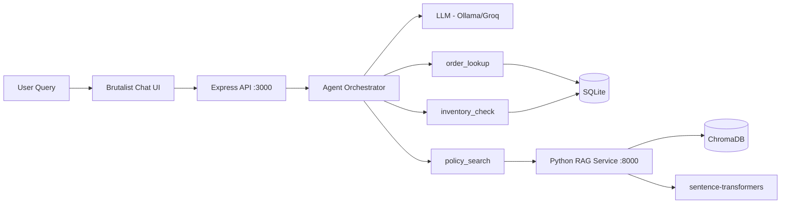

# E-Commerce Support Copilot

A customer support AI agent that connects to an MCP server exposing e-commerce tools. The agent analyzes conversation context and dynamically decides which tool(s) to call — order lookup, inventory check, policy search (RAG), or response drafting.

This mirrors the architecture used for a D365 Finance & Operations Copilot — Copilot Studio + custom MCP server for natural language queries on order status, inventory levels, and delivery exceptions.


## Architecture

```
                    ┌──────────────────────────────────────────┐
                    │         TypeScript (Node.js)              │
                    │                                          │
User Query ──────► │  Express API ──► Agent Orchestrator       │
                    │                    │        │             │
                    │                    ▼        ▼             │
                    │                  LLM    Tool Calls        │
                    │               ├── order_lookup (SQLite)   │
                    │               ├── inventory_check (SQLite)│
                    │               └── policy_search ─────────┼──► Python RAG Service
                    │                                          │    (FastAPI + ChromaDB)
                    └──────────────────────────────────────────┘
```



> **Note:** The MCP server registers 4 tools (including `response_draft`) for external clients. The internal agent orchestrator uses 3 tools — it synthesizes the final response itself via the agentic loop, avoiding a redundant LLM-within-LLM call.

## Why Hybrid TypeScript + Python?

Each language owns the domain it's best at:

- **TypeScript** for the MCP server and API — the SDK has first-class support, Zod catches tool schema errors at compile time, and it matches the Node.js ecosystem for backend services.
- **Python** for the RAG pipeline — ChromaDB, sentence-transformers, and the ML ecosystem are Python-native. FastAPI provides a clean async API.

They communicate via HTTP with a typed contract — Zod schemas on the TypeScript side, Pydantic models on the Python side.

## Real-World Application

This pattern mirrors a production D365 F&O Copilot that enables natural language queries for order status, inventory levels, and delivery exceptions via Microsoft Teams. The architecture is the same — MCP server exposing domain tools, an agent orchestrator that chains tools based on user intent, and a RAG service for policy/document search.

## Frontend

A brutalist industrial terminal-style chat UI is served at `http://localhost:3000`. Features:

- Hazard-stripe header, monospace everything (Archivo Black + JetBrains Mono)
- Live tool delegation blocks showing which tools the agent called
- Header metrics (messages sent, tool calls, response time)
- 6 clickable suggestion buttons for common queries
- No frameworks — single `public/index.html`

## Quick Start

### Prerequisites

- Node.js 20+
- Python 3.11+
- An LLM provider: [Ollama](https://ollama.ai) (local) or [Groq](https://console.groq.com) (free cloud tier)

### Option A: Local Development

**1. Start the RAG service (Python)**

```bash
cd rag-service
python3 -m venv venv
source venv/bin/activate
pip install -e ".[dev]"
python3 -m src.main
# Runs on http://localhost:8000 — auto-ingests policy documents on startup
```

**2. Start the MCP server (TypeScript)**

```bash
cd mcp-server
npm install
npm run seed    # Populate SQLite with mock data (10 customers, 20 products, 50 orders)
npm run dev     # Runs on http://localhost:3000
```

**3. Set up an LLM provider**

```bash
# Option A: Ollama (local, free)
ollama pull llama3.2

# Option B: Groq (cloud, free tier)
export LLM_PROVIDER=groq
export LLM_MODEL=llama-3.3-70b-versatile
export LLM_BASE_URL=https://api.groq.com/openai/v1
export LLM_API_KEY=gsk_your_key_here
```

**4. Test it**

```bash
curl -X POST http://localhost:3000/chat \
  -H "Content-Type: application/json" \
  -d '{"message": "Where is my order ORD-1001?"}'
```

### Option B: Docker Compose

```bash
cp .env.example .env
# Edit .env with your LLM provider settings
docker compose up --build
```

### Run the Demo

```bash
# With both services running:
cd mcp-server
npx tsx ../demo/demo.ts
```

## Example Conversations

### Single-tool query: Order lookup

```
Customer: "Where is my order ORD-1001?"
→ Agent calls: order_lookup({order_id: "ORD-1001"})
→ "Your order ORD-1001 is currently shipped. Your tracking number is
   JD172431982703 and the estimated delivery date is 2026-02-28."
```

### Single-tool query: Policy search

```
Customer: "What's your return policy for electronics?"
→ Agent calls: policy_search({query: "return policy for electronics"})
→ "Electronics must be returned within 15 days of delivery with all original
   packaging. Opened electronics may be subject to a 15% restocking fee.
   Defective items are exempt and can be returned within the full warranty period."
```

### Multi-tool chain: Order + Policy

```
Customer: "My order ORD-1001 seems delayed. What compensation can you offer?"
→ Agent calls: order_lookup({order_id: "ORD-1001"})
→ Agent calls: policy_search({query: "compensation for late delivery"})
→ "I can see your order ORD-1001 was shipped and has tracking number JD172431982703.
   Based on our compensation policy, for standard shipping delays of 1-3 days,
   we offer a 10% discount code for your next order..."
```

## Project Structure

```
ecommerce-support-copilot/
├── mcp-server/                     # TypeScript — MCP server + API + agent
│   ├── public/
│   │   └── index.html              # Brutalist terminal chat UI
│   ├── src/
│   │   ├── index.ts                # Entry point — Express server
│   │   ├── server.ts               # MCP server — registers tools with SDK
│   │   ├── config.ts               # Environment configuration
│   │   ├── agent/
│   │   │   ├── orchestrator.ts     # Agentic loop — LLM decides which tools to call
│   │   │   └── prompts.ts          # System prompts for tool selection
│   │   ├── tools/
│   │   │   ├── index.ts            # Tool registry
│   │   │   ├── order-lookup.ts     # Query orders by ID, email, status
│   │   │   ├── inventory-check.ts  # Check product stock levels
│   │   │   ├── policy-search.ts    # HTTP call to Python RAG service
│   │   │   └── response-draft.ts   # LLM-powered response drafting
│   │   └── db/
│   │       ├── models.ts           # Zod schemas + TypeScript types
│   │       ├── connection.ts       # SQLite setup with better-sqlite3
│   │       └── seed.ts             # Mock data generator
│   └── tests/
│       └── test-tools.ts           # Tool smoke tests
│
├── rag-service/                    # Python — RAG microservice
│   ├── src/
│   │   ├── main.py                 # FastAPI — POST /search, POST /ingest
│   │   ├── ingest.py               # Chunk → embed → store in ChromaDB
│   │   ├── retriever.py            # Similarity search
│   │   ├── models.py               # Pydantic request/response schemas
│   │   └── config.py               # ChromaDB + model settings
│   └── data/policies/              # Policy documents (returns, shipping, etc.)
│
├── demo/
│   └── demo.ts                     # Scripted demo scenarios
├── docker-compose.yml              # One-command startup
└── .env.example                    # Environment variable template
```

## Tech Stack

| Component | Technology | Why |
|-----------|-----------|-----|
| MCP Server | `@modelcontextprotocol/sdk` | Official SDK, first-class TypeScript support |
| API | Express.js | Lightweight, single endpoint needed |
| Schema Validation | Zod | Dual-use: runtime validation + MCP tool schemas |
| Database | better-sqlite3 | Synchronous, zero-config, mock ERP data |
| RAG Service | FastAPI + ChromaDB | Python-native ML ecosystem |
| Embeddings | sentence-transformers (all-MiniLM-L6-v2) | Runs locally, no API costs, 384-dim |
| LLM | Ollama / Groq (via openai package) | Free, swap via config |
| Type Safety | TypeScript 5 + Pydantic 2 | Compile-time guarantees on both sides |

## Key Concepts

### MCP (Model Context Protocol)
MCP is a standard protocol that defines how AI agents discover and call tools. The agent queries the MCP server for available tools and their schemas, then decides which to call. Same server can serve different agents/clients.

### Tool Delegation
The agent doesn't follow if/else rules. It receives the user message + tool descriptions, then the LLM reasons about which tool(s) to invoke. For multi-step queries, it chains tools autonomously.

### RAG (Retrieval-Augmented Generation)
Policy documents are chunked (~500 chars with overlap), embedded via sentence-transformers, and stored in ChromaDB. At query time, the user's question is embedded and compared to all chunks via cosine similarity. Top-k chunks are returned as context.

## API Reference

### POST /chat

```json
{
  "message": "Where is my order ORD-1001?",
  "history": [
    {"role": "user", "content": "previous message"},
    {"role": "assistant", "content": "previous response"}
  ]
}
```

Response:

```json
{
  "response": "Your order ORD-1001 is currently shipped...",
  "toolCalls": [
    {
      "tool": "order_lookup",
      "args": {"order_id": "ORD-1001"},
      "result": "..."
    }
  ],
  "timing": {"totalMs": 1234}
}
```

### GET /health

Returns service status, LLM configuration, and database stats.
